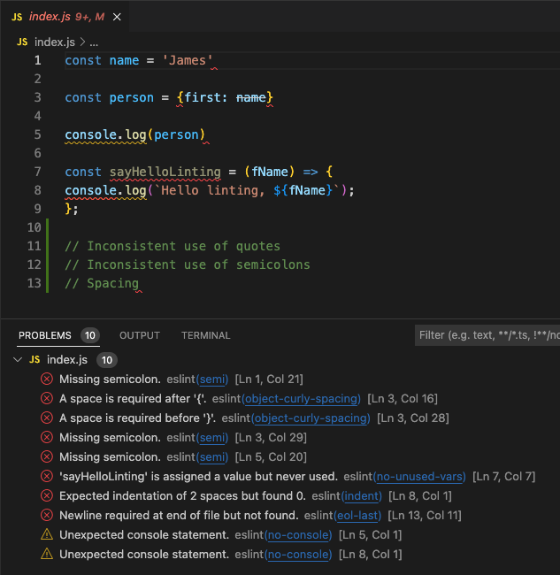
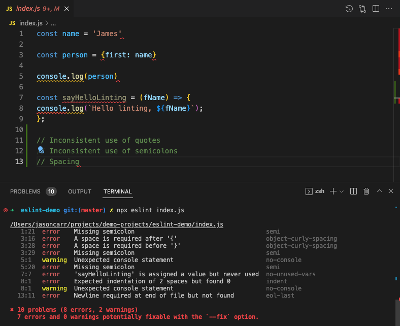

# Setting up ESLint

From [ESLint](https://eslint.org/docs/latest/user-guide/getting-started)

## Setup for each project

Set up package.json

`npm init -y`

You can install and configure ESLint using this command:

`npm init @eslint/config`

## VSCode Extension

Download the [ESLint extension](https://marketplace.visualstudio.com/items?itemName=dbaeumer.vscode-eslint) for vscode.

Output:


## Without VSCode Extension

Or without the extension, you can run ESLint on any file or directory from your terminal like this:

`npx eslint yourFile.js`

Output:


## Format on save (Optional)

> .vscode/settings.json

``` json
{
   "editor.codeActionsOnSave": {
       "source.fixAll.eslint": true
   },
   "eslint.validate": ["javascript"]

}

```
